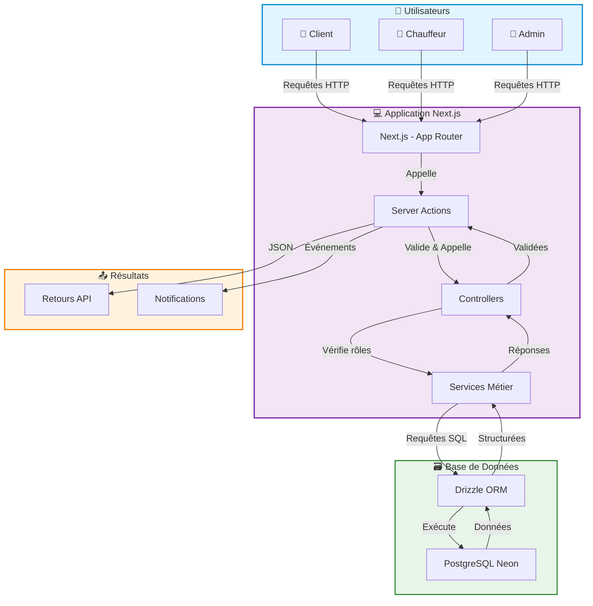

# AMT Express

<p align="center">
  
</p>

<p align="center">
  <strong>Plateforme de gestion de transport intelligent pour professionnels</strong>
</p>

<p align="center">
  <a href="#fonctionnalit%C3%A9s">Fonctionnalités</a> •
  <a href="#architecture">Architecture</a> •
  <a href="#installation">Installation</a> •
  <a href="#configuration">Configuration</a> •
  <a href="#tests">Tests</a> •
  <a href="#contribution">Contribution</a>
</p>

---

## 📋 À propos du projet

**AMT Express** est une plateforme web moderne de gestion de courses de taxi, conçue pour les entreprises de transport et leurs clients professionnels. L'application permet une gestion complète des trajets, des chauffeurs et de la facturation, avec une approche axée sur l'efficacité opérationnelle et l'expérience utilisateur.

### 🎯 Objectif principal

Fournir une solution tout-en-un pour :
- **Cataloguer** les courses de taxi
- **Distribuer** les courses parmi les chauffeurs via un planning dynamique
- **Générer** des factures à partir des courses (individuelles ou groupées)
- **Suggérer** des courses aux chauffeurs avecolicitation d'assignation
- **Importer** des données de courses via formulaire, texte, schéma ou photo (OCR)

### 📊 Statut du projet

| État | Fonctionnalité |
|------|----------------|
| ✅ **Terminé** | Gestion complète des courses (CRUD) |
| ✅ **Terminé** | Tableaux de bord Admin & Chauffeur avec KPI |
| ✅ **Terminé** | Système d'authentification avec rôles |
| ✅ **Terminé** | Base de données et schémas |
| ✅ **Terminé** | Internationalisation (i18n) Français/Anglais |
| ✅ **Terminé** | Import CSV des données |
| ✅ **Terminé** | Validation côté serveur avec Zod |
| 🚧 **En cours** | Suivi GPS en temps réel |
| 🚧 **En cours** | Intégration OCR pour scanning de tickets |
| 🚧 **En cours** | Intégration de paiement (Stripe/PayPal) |
| 🚧 **En cours** | Système de chat interne |
| 📋 **Prévu** | Notifications push en temps réel |
| 📋 **Prévu** | Application mobile réactive |

---

## 🎨 Fonctionnalités

### 👥 Gestion des utilisateurs

- **Inscription/Connexion** : Rôles distincts (Admin, Chauffeur, Client) avec authentification sécurisée
- **Récupération de mot de passe** : Lien de réinitialisation valide 24h
- **Validation des comptes chauffeurs** : Vérification manuelle par les administrateurs
- **Modification du profil** : Mise à jour des informations personnelles
- **Désactivation de compte** : Archivage des données conformément au RGPD

### 🚗 Gestion des courses

- **Ajout manuel** : Formulaire complet pour saisir tous les détails (date, heure, lieu, prix)
- **Import via texte/photo** : Extraction automatique des données via OCR
- **Suggestions de courses** : Algorithme de mise en correspondance basé sur la disponibilité et la localisation
- **Demande d'assignation** : Les chauffeurs peuvent demander à être assignés à une course
- **Historique des courses** : Consultation des trajets passés avec filtres avancés
- **Annulation de course** : Avec justification obligatoire (max 2h avant le départ)
- **Notation des chauffeurs** : Système de notation (1-5 étoiles) avec commentaires

### 📊 Vue Admin (Style Excel)

- **Tableau dynamique** : Filtres avancés, tri multi-colonnes, export de données
- **Export personnalisé** : Génération de fichiers CSV/PDF avec données filtrées (limite : 10 000 lignes)
- **Statistiques de courses** : Graphiques et indicateurs clés (nombre, revenus, etc.)
- **Rafraîchissement automatique** : Mise à jour quotidienne des données

### 💰 Facturation

- **Création de factures** : Sélection des courses, numérotation automatique
- **Facturation groupée** : Regroupement par client ou par période
- **Rappels automatiques** : Envoi automatique de rappels (J+7, J+14, J+30)
- **Remise exceptionnelle** : Application de réductions avec justification requise
- **Envoi par application** : Envoi immédiat avec historique préservé
- **Gestion manuelle des rappels** : Messages personnalisés (max 3 rappels configurables)

### 🔔 Notifications

- **Alertes en temps réel** : Nouvelles courses, affectations, factures
- **Personnalisation des canaux** : Choix entre email et notifications in-app
- **Notifications urgentes** : Alertes push + email pour les événements critiques

### 🗺️ Fonctionnalités supplémentaires

- **Géolocalisation des trajets** : Intégration avec Mapbox/Google Maps
- **Chat en temps réel** : Communication entre chauffeurs et clients
- **Suivi GPS en direct** : Position du chauffeur visible par le client
- **Paiement partiel** : Minimum 30% du montant total
- **Intégration calendrier** : Synchronisation bidirectionnelle avec Google Calendar/Outlook

---

## 🏗️ Architecture

### Stack Technique

| Catégorie | Technologie | Version | Justification |
|-----------|-------------|---------|---------------|
| **Framework Frontend** | Next.js | 16.1.1 | Server Components, App Router, Server Actions |
| **Langage** | TypeScript | 5.x | Typage fort, meilleure maintenabilité |
| **UI Library** | React | 19.2.3 | Composants réutilisables |
| **Base de données** | PostgreSQL | 18 | Research SQL, conformité ACID |
| **Database Provider** | Neon | - | Serverless, branching, free tier généreux |
| **ORM** | Drizzle ORM | 0.45.1 | TypeScript-first, léger, SQL-like |
| **Authentification** | Better Auth | 1.4.10 | Typage TypeScript, architecture moderne |
| **Validation** | Zod | 4.3.5 | Validation des données côté serveur |
| **Tests** | Vitest | 4.0.16 | Tests rapides et efficaces |
| **Internationalisation** | i18next | 25.7.4 | Support multi-langues complet |
| **Graphiques** | Recharts | 3.6.0 | Visualisation de données interactive |
| **Icônes** | Lucide React | 0.562.0 | Icônes modernes et légères |

### Architecture Logicielle

```bash
amt-express/
├── app/                              # Pages et layouts (App Router)
│   ├── @admin/                       # Espace administrateur
│   ├── @auth/                        # Pages d'authentification
│   ├── @customer/                    # Espace client
│   ├── @driver/                      # Espace chauffeur
│   └── connections/                  # Connexion/Inscription
├── components/                       # Composants React
│   ├── admin/                       # Composants admin
│   ├── classicComponents/           # Composants génériques
│   ├── customer/                     # Composants client
│   ├── dashboard/                    # Composants tableau de bord
│   └── specificCards/                # Cartes spécialisées
├── lib/                              # Logique métier
│   ├── actions/                      # Server Actions
│   ├── controllers/                  # Contrôleurs
│   ├── services/                     # Services métier
│   ├── validations/                  # Validations Zod
│   └── db/                           # Configuration DB & Schéma
├── context/                          # Contextes React
├── content/                          # Types et constantes
├── locales/                          # Traductions (fr.json, en.json)
├── test/                             # Tests Vitest
│   ├── unit/                         # Tests unitaires
│   └── integration/                  # Tests d'intégration
└── scripts/                          # Scripts utilitaires
```

### Diagramme de Flux de Données




### Système d'Authentification

L'application utilise **Better Auth** avec :
- **Rôles** : admin, driver, customer
- **Middleware de rôles** : Vérification des permissions
- **Gestion des sessions** : Sessions sécurisées
- **Bannissement** : Possibilité de bannir des utilisateurs

### Schéma de la Base de Données

**18 tables** principales : utilisateurs, chauffeurs, courses, projets, factures, notifications, etc.

Voir [lib/db/schema.ts](amt-express/lib/db/schema.ts) pour le schéma complet.

---

## 🚀 Installation

### Prérequis

- Node.js v24.7.0+
- npm / pnpm (recommandé)
- Docker (optionnel)
- PostgreSQL (Neon recommandé)

### Installation locale

1. Cloner le dépôt :
```bash
git clone https://github.com/Mamoru-fr/AMT-Express.git
cd AMT-Express/amt-express
```

2. Installer les dépendances :
```bash
pnpm install
```

3. Configurer l'environnement :
```bash
cp .env.example .env.local
# Éditer .env.local avec vos informations
```

4. Configurer la base de données :
```bash
pnpm db:migrate
```

5. Démarrer l'application :
```bash
pnpm dev
```

Ouvrir [http://localhost:3000](http://localhost:3000)

### Développement avec Docker

1. Configurer .env :
```bash
cp .env.example .env.local
```

2. Démarrer le stack :
```bash
docker compose up -d --build
```

3. Accéder à [http://localhost:3000](http://localhost:3000)

4. Arrêter :
```bash
docker compose down
```

### Production

Build l'image :
```bash
docker build -t amt-express:latest .
```

Exécuter :
```bash
docker run -p 3000:3000 --env-file .env.local amt-express:latest
```

---

## ⚙️ Configuration

### Variables d'Environnement

| Variable | Description | Requise |
|----------|-------------|---------|
| DATABASE_URL | URL PostgreSQL | ✅ |
| AUTH_SECRET | Clé secrète Better Auth | ✅ |
| NEXT_PUBLIC_APP_URL | URL de l'application | ✅ |
| DB_DRIVER | Driver de base de données | ❌ |

### Configuration de la Base de Données

- **Neon HTTP** : Pour connexions serverless (recommandé)
- **Postgres.js** : Pour connexions classiques

### Configuration des Rôles

Les rôles sont définis dans [content/database_types/roles.ts](amt-express/content/database_types/roles.ts).

Rôle par défaut : `customer` (configurable dans [lib/auth/auth.ts](amt-express/lib/auth/auth.ts)).

---

## 🧪 Tests

### Commandes

```bash
pnpm test              # Tous les tests
pnpm test:unit         # Tests unitaires
pnpm test:auth         # Tests auth
pnpm test:rides        # Tests gestion courses
pnpm test:integration  # Tests d'intégration
pnpm test:watch        # Mode surveillance
pnpm test:coverage     # Avec coverage
pnpm ci                # CI - Build + Tests
```

### GitHub Actions

- `build.yml` : Build de l'application
- `tests-*.yml` : Tests spécifiques
- `ci-full.yml` : Pipeline complet

---

## 📁 Structure du Projet

Voir la section **Architecture Logicielle** pour la structure complète.

---

## 🌍 Internationalisation

Supporte **Français** et **Anglais** via i18next.

- Fichiers : `locales/fr.json`, `locales/en.json`
- Fournisseur : `context/I18nProvider.tsx`

---

## 🔒 Sécurité

- ✅ Validation des entrées (Zod)
- ✅ Authentification sécurisée (Better Auth)
- ✅ Protection des routes (Middleware)
- ✅ Journal d'audit
- ✅ Gestion des sessions
- ✅ Protection CSRF
- ✅ Chiffrement

---

## 🤝 Contribution

1. Forker le projet
2. Créer une branche (`git checkout -b feature/ma-fonctionnalite`)
3. Commiter vos changements
4. Pousser vers la branche
5. Ouvrir une Pull Request

### Règles

- Respecter la structure
- Ajouter des tests
- Documenter les changements
- Messages de commit clairs
- Conventions de nommage (PascalCase, camelCase, UPPER_CASE)

---

## 📄 Documentation

- [Architecture Technique](documentation/TECHNICAL_ARCHITECTURE.md)
- [Spécifications Fonctionnelles](Instructions/Functional%20Requierement%20Moonshot.md)

---

## 📜 Licence

MIT © 2026 Alexis Santos (Mamoru)

---

<p align="center">
  Made with care by <a href="https://github.com/Mamoru-fr">Mamoru</a>
</p>