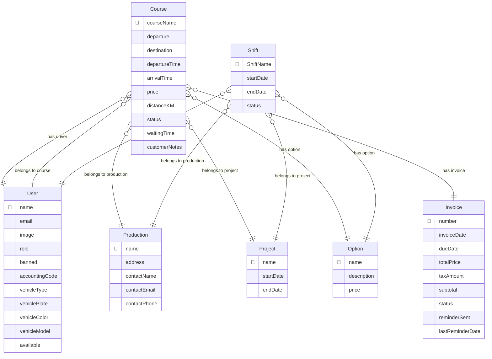

| Course                         |
| ------------------------------ |
| **CourseName**                 |
| Departure                      |
| Destination                    |
| DepartureTime                  |
| ArrivalTime                    |
| Price                          |
| DistanceKM                     |
| Status                         |
| Waiting Time                   |
| CustomerNotes                  |
| <ins>**#DriverName**</ins>     |
| <ins>**#Productionname**</ins> |
| <ins>**#ProjectName**</ins>    |

| User            |
| --------------- |
| **Name**        |
| Email           |
| Image           |
| Role            |
| Banned          |
| Accounting Code |
| Vehicle Type    |
| Vehicle Plate   |
| Vehicle Color   |
| Vehicle Model   |
| Available       |

| CourseClient                 |
| ---------------------------- |
| <ins>**#CourseName**</ins>   |
| <ins>**#CustomerName**</ins> |

| Shift                         |
| ----------------------------- |
| <ins>**#DriverName**</ins>    |
| StartDate                     |
| EndDate                       |
| Status                        |
| <ins>**ProductionName**</ins> |
| <ins>**ProjectName**</ins>    |

| Option      |
| ----------- |
| **Name**    |
| Description |
| Price       |

| OptionCourse               |
| -------------------------- |
| <ins>**#OptionName**</ins> |
| <ins>**#CourseName**</ins> |

| Project                       |
| ----------------------------- |
| **Name**                      |
| <ins>**ProductionName**</ins> |
| StartDate                     |
| EndDate                       |

| Production    |
| ------------- |
| **Name**      |
| Address       |
| Contact Name  |
| Contact Email |
| Contact Phone |

| Invoice                    |
| -------------------------- |
| **Number**                 |
| <ins>**#CourseName**</ins> |
| InvoiceDate                |
| DueDate                    |
| totalPrice                 |
| taxAmount                  |
| Subtotal                   |
| Status                     |
| reminderSent               |
| lastReminderDate           |

