<h1 style='text-align: center'>AMT Horizon</h1>
<h2 style='text-align: center'>Functional Specification Document</h2>

<h3 style='text-align: center'>DOCUMENT VERSION 2.0</h3>
<h3 style='text-align: center'>16/01/2026</h3>

---

<h3>Author</h3>

| Name          | Role                        |
| ------------- | --------------------------- |
| Alexis SANTOS | Program Manager / Tech Lead |

<h3>Revision History</h3>

| Date       | Version | Description of Changes                                                                                                                                                                                                                                                                                                                                                                                                                                                                                                                                                                                                                                                                                                                                                                                                                                                                                                                  |
| ---------- | :-----: | --------------------------------------------------------------------------------------------------------------------------------------------------------------------------------------------------------------------------------------------------------------------------------------------------------------------------------------------------------------------------------------------------------------------------------------------------------------------------------------------------------------------------------------------------------------------------------------------------------------------------------------------------------------------------------------------------------------------------------------------------------------------------------------------------------------------------------------------------------------------------------------------------------------------------------------- |
| 04/01/2026 |   1.0   | <li>Document creation and drafting of sections Overview, A to E.</li> <li>Added Functional Requirements.</li>                                                                                                                                                                                                                                                                                                                                                                                                                                                                                                                                                                                                                                                                                                                                                                                                                           |
| 08/01/2026 |   1.1   | <li>Translated code and technical sections to English.</li> <li>Adapted for NextJS, Vitest, Neon, Drizzle, better-auth.</li>                                                                                                                                                                                                                                                                                                                                                                                                                                                                                                                                                                                                                                                                                                                                                                                                            |
| 14/01/2026 |   1.2   | <li>Separated Functional and Technical Specifications into distinct documents.</li> <li>Added Page Functionality section.</li> <li>Updated Functional Requirements with detailed descriptions.</li>                                                                                                                                                                                                                                                                                                                                                                                                                                                                                                                                                                                                                                                                                                                                     |
| 16/01/2026 |   2.0   | <li><strong>Restructured Functional Requirements</strong> into clear, non-technical lists grouped by functional areas (User Management, Ride Management, etc.).</li> <li><strong>Added Two-Factor Authentication</strong> to the login flow.</li> <li><strong>Improved Mermaid diagrams</strong> for clarity and consistency, including error handling and validation steps.</li> <li><strong>Enhanced Personas section</strong> with textual summaries alongside mindmaps.</li> <li><strong>Removed redundant content</strong> between Product Functional Capabilities and Functional Requirements.</li> <li><strong>Added GDPR compliance notes</strong> to relevant flows (e.g., account deactivation, data export).</li> <li><strong>Standardized terminology</strong> across the document.</li> <li><strong>Added notes for edge cases</strong> (e.g., OCR failure, validation errors) directly in diagrams where applicable.</li> |

---

<details>
<summary><strong>Table of Contents</strong></summary>

- [I. General Overview](#i-general-overview)
  - [A. Product Description](#a-product-description)
  - [B. Product Functional Capabilities](#b-product-functional-capabilities)
  - [C. Project Organization](#c-project-organization)
    - [Project Representatives](#project-representatives)
    - [Stakeholders](#stakeholders)
- [II. Requirements](#ii-requirements)
  - [A. Functional Requirements](#a-functional-requirements)
    - [1. User Management](#1-user-management)
    - [2. Ride Management](#2-ride-management)
    - [3. Admin Tools](#3-admin-tools)
    - [4. Billing and Payments](#4-billing-and-payments)
    - [5. Notifications](#5-notifications)
    - [6. Additional Features](#6-additional-features)
  - [B. Non-Functional Requirements](#b-non-functional-requirements)
- [III. Personas](#iii-personas)
  - [A. Business Manager (Marc, 55, Schedule Management)](#a-business-manager-marc-55-schedule-management)
  - [B. Administrative Secretary (Nathalie, 47, Billing Efficiency)](#b-administrative-secretary-nathalie-47-billing-efficiency)
  - [C. Driver (Djamel, 39, Income Maximizer)](#c-driver-djamel-39-income-maximizer)
  - [D. Classic Customer (Jean-Michel, 62, Reliability Focus)](#d-classic-customer-jean-michel-62-reliability-focus)
  - [E. Corporate Customer (Claire, 41, Team Ride Planning)](#e-corporate-customer-claire-41-team-ride-planning)
- [IV. Page Functionality](#iv-page-functionality)
  - [A. Login Page](#a-login-page)
  - [B. Admin Dashboard](#b-admin-dashboard)
    - [1. Ride Management Flow](#1-ride-management-flow)
    - [2. Manage Drivers Flow](#2-manage-drivers-flow)
    - [3. Manage Customers Flow](#3-manage-customers-flow)
    - [4. View Reports \& Statistics Flow](#4-view-reports--statistics-flow)
  - [C. Driver Dashboard](#c-driver-dashboard)
    - [1. View Suggested Rides Flow](#1-view-suggested-rides-flow)
    - [2. Manage Availability Flow](#2-manage-availability-flow)
    - [3. Notifications Flow](#3-notifications-flow)
    - [4. Earnings \& Ratings Flow](#4-earnings--ratings-flow)
  - [D. Customer Dashboard](#d-customer-dashboard)
    - [1. Book a Ride Flow](#1-book-a-ride-flow)
    - [2. Track Rides Flow](#2-track-rides-flow)
    - [3. Manage Payments Flow](#3-manage-payments-flow)
    - [4. Notifications Flow](#4-notifications-flow)
    - [5. Rate Drivers Flow](#5-rate-drivers-flow)
    - [6. Contact Support Flow](#6-contact-support-flow)
  - [E. Billing Page (Admin)](#e-billing-page-admin)
    - [1. Invoice Generation Flow](#1-invoice-generation-flow)
    - [2. Payment Tracking Flow](#2-payment-tracking-flow)
    - [3. Discounts Flow](#3-discounts-flow)
    - [4. Export Flow](#4-export-flow)
  - [F. Notifications Page (All Users)](#f-notifications-page-all-users)
  - [G. Profile Page (All Users)](#g-profile-page-all-users)
  - [H. OCR Import Page (Admin/Drivers)](#h-ocr-import-page-admindrivers)
  - [I. Admin Excel-like View](#i-admin-excel-like-view)
  - [J. Real-Time Chat (Drivers/Customers)](#j-real-time-chat-driverscustomers)
  - [K. Geolocation \& Maps (Drivers/Customers)](#k-geolocation--maps-driverscustomers)
  - [L. Calendar Integration](#l-calendar-integration)

</details>

---

# I. General Overview

**Client Request**: A **web and mobile application** to manage taxi rides, driver assignments, and billing. The goal is to provide an **intuitive, all-in-one solution** for admin, drivers, and customers, featuring **automatic ride data import** and **smart ride suggestions**.  
AMT Horizon is designed to **simplify daily operations** for taxi companies by replacing manual processes with a streamlined digital system. The application helps:

- **Reduce errors** through automation of repetitive tasks.
- **Save time** with real-time scheduling and tracking tools.
- **Improve satisfaction** for both drivers and customers with a smooth, transparent experience.

## A. Product Description

AMT Horizon is a **complete taxi management platform** that enables:
- **Centralized recording and organization** of taxi rides.
- **Automatic ride distribution** to drivers based on their **availability and location**.
- **Invoice generation** (individual or grouped) with **automatic payment reminders** for overdue bills.
- **Smart ride suggestions** for drivers, allowing them to accept or request assignments based on their preferences.
- **Easy data import** from forms, text, or even **photos of tickets or invoices** (no manual entry required).

This solution meets the needs of:
- **Fleet managers**, who need a **clear dashboard** to oversee operations and generate reports.
- **Drivers**, who want to **maximize earnings** and manage their trips flexibly.
- **Customers**, who expect **easy booking**, **real-time tracking**, and **secure payment options**.

## B. Product Functional Capabilities

- **User Management**: [See II.A.1](#1-user-management)
- **Ride Management**: [See II.A.2](#2-ride-management)
- **Admin Dashboard**: [See II.A.3](#3-admin-tools)
- **Billing and Payments**: [See II.A.4](#4-billing-and-payments)
- **Notifications**: [See II.A.5](#5-notifications)
- **Additional Features**: [See II.A.6](#6-additional-features)

## C. Project Organization

### Project Representatives

| Project Owner | Represented by...  |
| ------------- | ------------------ |
| Client        | Alexis SANTOS (PM) |

### Stakeholders

| Stakeholder | Key Interests                                      |
| ----------- | -------------------------------------------------- |
| Admins      | Full ride and invoice management, reporting.       |
| Drivers     | Access to suggested rides management.              |
| Customers   | Easy booking, real-time tracking, secure payments. |

---

Voici une version **réorganisée et simplifiée** de la section **II. Requirements**, adaptée pour un public non technique tout en conservant la clarté et la structure. J'ai transformé les tableaux en **listes structurées** et regroupé les fonctionnalités par thème logique, avec des descriptions en langage naturel.

---

# II. Requirements

## A. Functional Requirements

### 1. User Management
**Objective**: Ensure secure and efficient management of user accounts for all roles (Admins, Drivers, Customers).

- **Account Creation and Login**  
  Users can create accounts and log in securely using their email and password. The system supports three roles: Admin, Driver, and Customer.   
  (Detailed flow: [IV.A. Login Page](#a-login-page))

- **Password Recovery**  
  Users can reset their password via a secure link sent to their email, valid for 24 hours.

- **Driver Account Validation**  
  Admins manually verify driver accounts using submitted documents (ID card, driver’s license) within 24 hours.

- **Profile Updates**  
  Users can update their personal information (email, phone number) with validation to ensure data accuracy.

- **Account Deactivation**  
  Admins can deactivate user accounts, with optional reasons provided. Deactivated accounts are archived in compliance with data protection regulations.  
  (Detailed flow: [IV.G. Account Deactivation](#g-profile-page-all-users))

---

### 2. Ride Management
**Objective**: Streamline the process of creating, assigning, and tracking rides.

- **Manual Ride Entry**  
  Users add rides via a form (date, time, location, price).  
  (Detailed flow: [IV.B.1 Ride Management Flow](#1-ride-management-flow))

- **Automatic Ride Import**  
  Admins/drivers upload ticket/invoice photos. System extracts data automatically with manual validation.  
  (Detailed flow: [IV.H. OCR Import Page](#h-ocr-import-page-admindrivers))  
  > [!Note] 
  > If OCR fails, users manually correct data before saving.

- **Ride Suggestions**  
  System suggests rides based on driver availability/location.  
  (Detailed flow: [IV.C.1 View Suggested Rides Flow](#1-view-suggested-rides-flow))

- **Ride Assignment Requests**  
  Drivers request assignments (max 5 simultaneous requests).

- **Ride History**  
  Drivers and customers view past rides (each user sees only their own rides).  
  (Detailed flow: [IV.D.2 Track Rides Flow](#2-track-rides-flow))

- **Ride Cancellation**  
  Customers and admins can cancel rides up to 2 hours before departure with a mandatory reason.  

- **Driver Ratings**  
  Customers rate drivers (1-5 stars) post-ride.  
  (Detailed flow: [IV.D.5 Rate Drivers Flow](#5-rate-drivers-flow))

---

### 3. Admin Tools
**Objective**: Provide admins with powerful tools to manage rides, drivers, and data.

- **Dynamic Ride Table**
  Admins view, sort, filter, and export ride data (max 10,000 rows).  
  (Detailed flow: [IV.I. Admin Excel-like View](#i-admin-excel-like-view))

- **Statistics and Reports**
  System generates daily charts/reports on rides, revenue, and performance.

---

### 4. Billing and Payments
**Objective**: Automate and simplify the billing process for admins and customers.

- **Invoice Creation**
  Admins can generate individual or grouped invoices automatically, with unique numbering.  
  (Detailed flow: [IV.E.1 Invoice Generation Flow](#1-invoice-generation-flow))

- **Payment Reminders**
  The system sends automatic email reminders for overdue payments at set intervals (D+14, D+21, and D+30 after the due date).  
  (Detailed flow: [IV.E.2 Payment Tracking Flow](#2-payment-tracking-flow))

- **Discounts**
  Admins can apply exceptional discounts to invoices, with mandatory justification.  
  (Detailed flow: [IV.E.3 Discounts Flow](#3-discounts-flow))

- **Invoice Delivery**
  Invoices can be sent directly through the app, with PDF attachments and status updates.  
  (Detailed flow: [IV.E.1 Invoice Generation Flow](#1-invoice-generation-flow))

- **Partial Payments**
  Customers can make partial payments (minimum 30% of the total amount).

---

### 5. Notifications
**Objective**: Keep all users informed with real-time alerts and customizable notifications.

- **Real-Time Alerts**
  Users receive notifications for new rides, assignments, and invoices via email or in-app alerts.  

- **Customizable Channels**
  Users can choose their preferred notification method (email, in-app, or push notifications).

- **Urgent Notifications**
  The system sends immediate alerts for critical events, such as ride cancellations by customers.

---

### 6. Additional Features
**Objective**: Enhance the user experience with advanced tools and integrations.

- **Geolocation and Maps**
  Drivers and customers can view ride locations and track routes in real-time using integrated maps.  
  (Detailed flow: [IV.K. Geolocation & Maps](#k-geolocation--maps-driverscustomers))

- **In-App Chat**
  Drivers and customers can communicate directly through a built-in chat, with a 30-day message history.  
  (Detailed flow: [IV.J. Real-Time Chat](#j-real-time-chat-driverscustomers))

- **Calendar Integration**
  Drivers can sync their ride schedules with personal calendars (Google Calendar, Outlook).  
  (Detailed flow: [IV.L. Calendar Integration](#l-calendar-integration))

- **Activity Logs**
  Admins can view logs of user actions, retained for 6 months in compliance with GDPR.

- **Two-Factor Authentication**
  Two-factor authentication is mandatory for admins and optional for other users for enhanced security.  
  (Detailed flow: [IV.A. Login Page](#a-login-page))

---

## B. Non-Functional Requirements

- **OCR Accuracy**: The system must accurately extract data from photos or documents with at least **90% precision**.

- **Performance**: Critical actions (e.g., ride assignment, payment processing) must complete in **under 2 seconds** to ensure a smooth user experience.

- **Security**: All user data must be encrypted and stored in compliance with **GDPR and other data protection regulations**.

- **Support Response Time**: Customer support must respond to inquiries within **24 hours** during business days.

---

# III. Personas

## A. Business Manager (Marc, 55, Schedule Management)
*Manager of a small taxi fleet in Île-de-France*

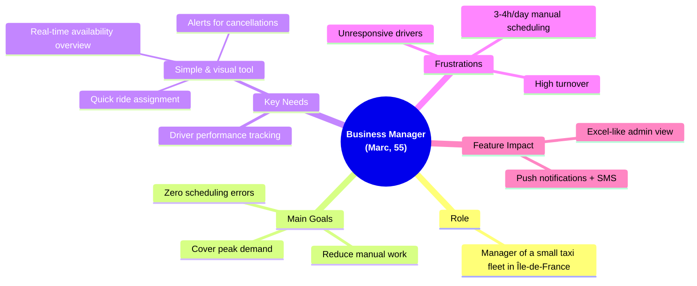

---

## B. Administrative Secretary (Nathalie, 47, Billing Efficiency)

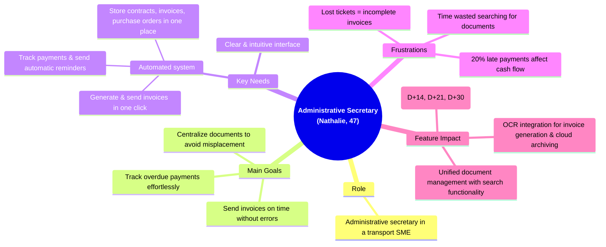

## C. Driver (Djamel, 39, Income Maximizer)

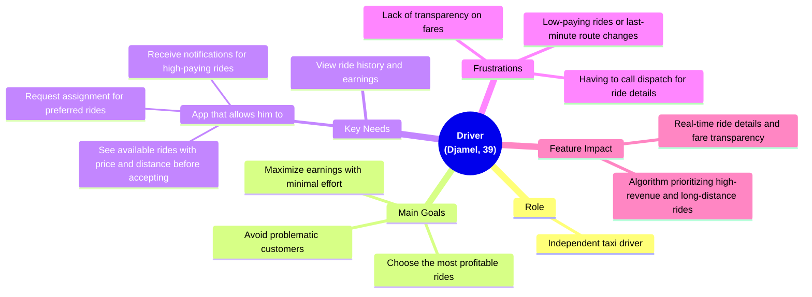

## D. Classic Customer (Jean-Michel, 62, Reliability Focus)

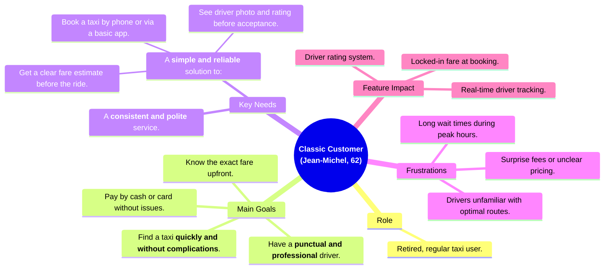

## E. Corporate Customer (Claire, 41, Team Ride Planning)

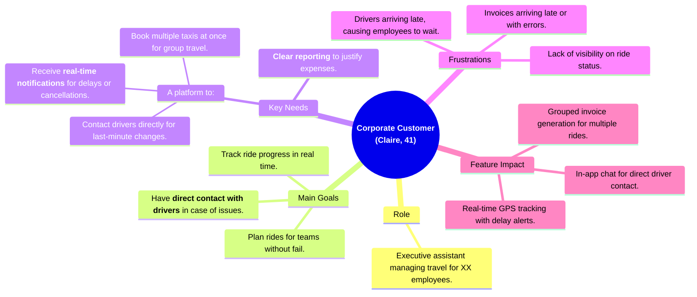

---

# IV. Page Functionality

## A. Login Page
- **Purpose**: Authenticate users and redirect them to their respective dashboards.
- **Actors**: All users.
- **Features**:

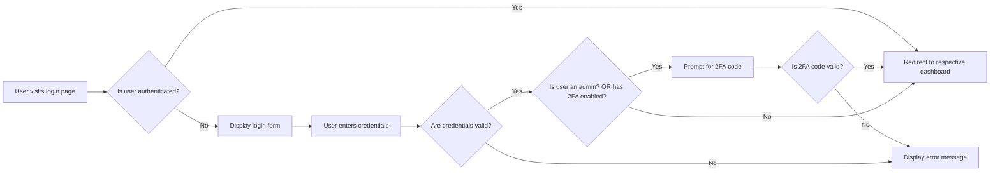

---

## B. Admin Dashboard
- **Purpose**: Central hub for managing rides, drivers, customers, and invoices.
- **Actors**: Admins.
- **Features**:

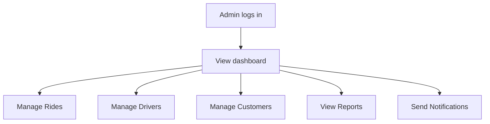

### 1. Ride Management Flow
- **Purpose**: Add, edit, delete, assign rides, and import via OCR.

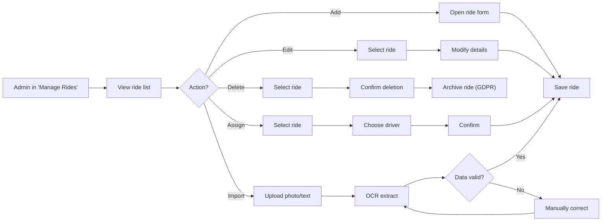

> [!Note]
> - Deleted rides are archived for 6 months (GDPR compliance). 
> - OCR errors route to manual correction.

### 2. Manage Drivers Flow
- **Purpose**: Add, edit, deactivate drivers, and validate documents.

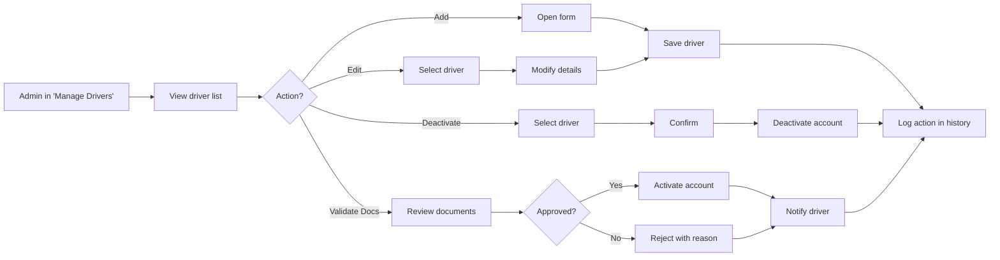

### 3. Manage Customers Flow
- **Purpose**: Add, edit, and deactivate customers.

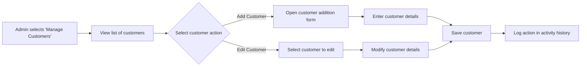

### 4. View Reports & Statistics Flow
- **Purpose**: View ride statistics, financial reports, and export data.

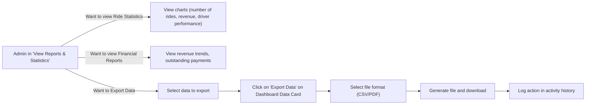

---

## C. Driver Dashboard
- **Purpose**: View/manage rides, availability, earnings, and notifications.
- **Actors**: Drivers.
- **Features**:  

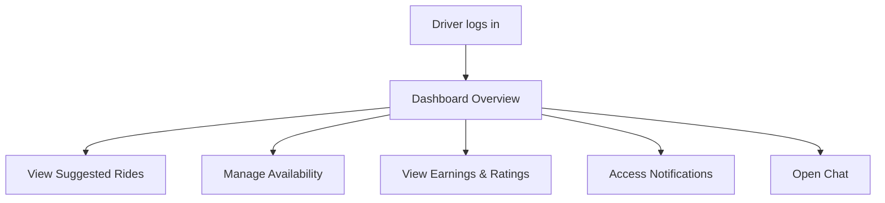

### 1. View Suggested Rides Flow
- **Purpose**: View/request assignment for suggested rides.

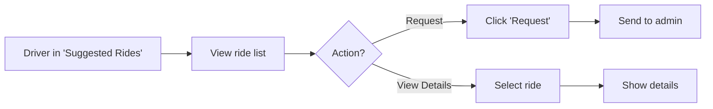

> [!Note]
> - Rides suggested based on location/availability.
> - Max 5 simultaneous requests per driver.

### 2. Manage Availability Flow
- **Purpose**: Toggle availability status for ride suggestions.

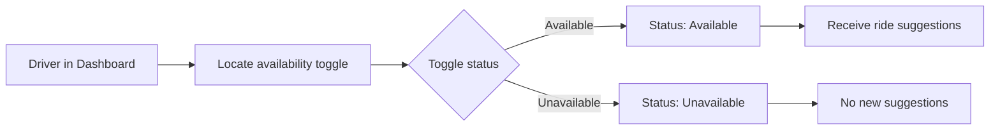

> [!Note]
> - Drivers only receive suggestions when marked as Available.
> - Status updates are instantaneous.

### 3. Notifications Flow
- **Purpose**: View and manage notifications for rides, assignments, and messages.

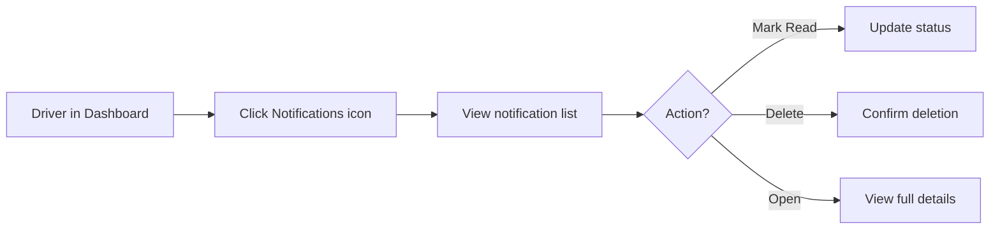

> [!Note]
> - Notifications include ride assignments, messages, and payment confirmations.
> - Unread notifications are highlighted.


### 4. Earnings & Ratings Flow
- **Purpose**: View their earnings, completed rides, and customer ratings.

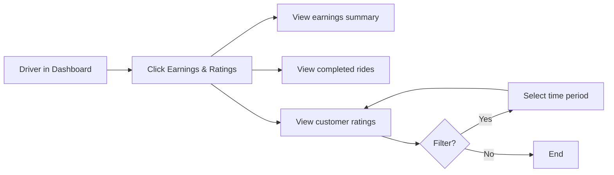

> [!Note]
> - Earnings updated in real-time.
> - Ratings include comments and 1-5 star scores.


---

## D. Customer Dashboard
- **Purpose**: Book rides, track trips, manage payments, and rate drivers.
- **Actors**: Customers.
- **Features**:

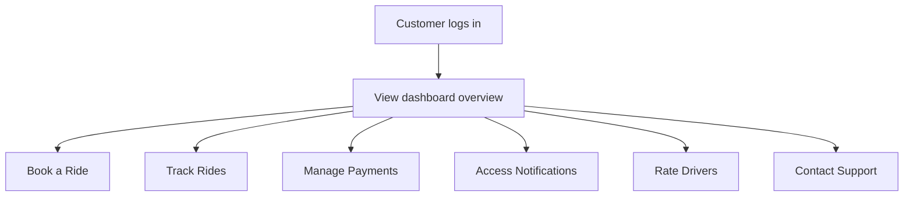

### 1. Book a Ride Flow
- **Purpose**: Book rides, view estimated fares, and manage ride history.

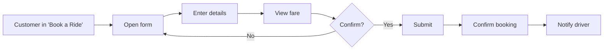

> [!Note]
> - Fare locked at booking (no surprises).
> - Driver receives real-time notification.


### 2. Track Rides Flow
- **Purpose**: Track assigned rides in real-time and view ride history.

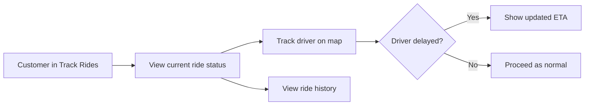

> [!Note]
> - Real-time GPS tracking with estimated arrival time.
> - History includes receipts and driver ratings.

### 3. Manage Payments Flow
- **Purpose**: Manage ride payments, view invoices, and receive notifications.

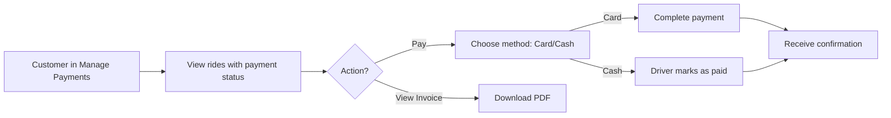

> [!Note]
> - Partial payments allowed (minimum 30%).
> - Cash payments require driver confirmation in-app.

### 4. Notifications Flow
- **Purpose**: View and manage ride/status notifications.

```mermaid
flowchart LR
    A["Customer in Dashboard"] --> B[Click Notifications]
    B --> C[View list]
    C --> D{Action?}
    D -- Mark Read --> E[Update status]
    D -- Open --> F[View details]
    D -- Delete --> G[Confirm deletion]

```

> [!Note]
> - Notifications include **ride status, payment confirmations**, and **support messages**.
> - Urgent alerts (e.g., cancellations) trigger **push notifications**.

### 5. Rate Drivers Flow
- **Purpose**: Rate drivers post-ride.

```mermaid
flowchart LR
    A["Customer post-ride"] --> B[Notification to rate]
    B --> C[Open rating form]
    C --> D["Submit rating (1-5 stars)"]
    D --> E[Add optional comment]
    E --> F[Confirm submission]
    F --> G[Driver receives feedback]
```

> [!Note]
> - Ratings are anonymous but linked to the ride
> - Drivers can respond to comments via in-app chat
>   - Warning for inappropriate comments.


### 6. Contact Support Flow
- **Purpose**: Contact admins via in-app chat for support.

```mermaid
flowchart LR
    A["Customer in Dashboard"] --> B[Click Contact Support]
    B --> C[Open chat interface]
    C --> D[Send message]
    D --> E[Admin responds]
    E --> F[Conversation saved for 30 days]
```

> [!Note]
> - Support responses within 24 hours.
> - Chat history archived for reference.

---

## E. Billing Page (Admin)
- **Purpose**: Manage invoicing, payments, discounts, exports, and financial reporting.
- **Actors**: Admins.
- **Features**:

```mermaid
flowchart TB
    A[Admin opens Billing Page] --> B[View invoicing options]
    B --> C[Generate Invoices]
    B --> D[Track Payments]
    B --> E[Apply Discounts]
    B --> F[Export Financial Data]
```

### 1. Invoice Generation Flow
- **Purpose**: Create individual or grouped invoices.

```mermaid
flowchart LR
    A["Admin in 'Generate Invoices'"] --> B[Select rides]
    B --> C{Type?}
    C -- Individual --> D[Generate PDF] --> E[Send invoice]
    C -- Grouped --> F[Select multiple rides] --> D
```

> [!Note]
> - Invoices auto-numbered.
> - Sent via email/in-app.


### 2. Payment Tracking Flow
- **Purpose**: Track payment status and send automatic reminders for overdue invoices.

```mermaid
flowchart LR
    A["Admin in Track Payments"] --> B[View payment status list]
    B --> C{Action?}
    C -- Send Reminder --> D[Select overdue invoices]
    D --> E["Send reminder (D+14, D+21, D+30)"]
    C -- Update Status --> F[Select invoice] --> G[Mark as paid/cancelled]
    G --> H[Log action]
```

> [!Note]
> - Max 3 reminders per invoice.
> - Status updates trigger customer notifications.


### 3. Discounts Flow
- **Purpose**: Apply exceptional discounts to invoices with justification.

```mermaid
flowchart LR
    A["Admin in Apply Discounts"] --> B[Select invoice]
    B --> C[Enter discount %]
    C --> D[Provide justification]
    D --> E[Apply discount]
    E --> F[Update invoice]
    F --> G[Notify customer]
```

> [!Note]
> - Justification archived for auditing.


### 4. Export Flow
- **Purpose**: Export invoices/financial reports to CSV/PDF.

```mermaid
flowchart LR
    A["Admin in Export"] --> B[Select data range]
    B --> G[Click on 'Export' button] --> C[Choose format: CSV/PDF]
    C --> D[Generate file]
    D --> E[Download]
    E --> F[Log export in history]
```

> [!Note]
> - Max 10,000 rows per export.
> - Exports include timestamp and admin ID.

---

## F. Notifications Page (All Users)
- **Purpose**: Centralize notifications for rides, invoices, and alerts.
- **Actors**: All users.
- **Features**:
  
```mermaid
flowchart LR
    A[User opens Notifications] --> B[View list]
    B --> C{Action?}
    C -- Mark Read --> D[Update status]
    C -- Filter --> E[Select type] --> F[View filtered]
    C -- Customize --> G[Open settings] --> H[Save preferences]
    C -- View Details --> I[Open notification]
    I -- Mark Read --> D
```

> [!Note]
> - Notifications retained for 30 days.
> - Urgent alerts (e.g., cancellations) trigger push + email.


---

## G. Profile Page (All Users)
- **Purpose**: View and edit personal information.
- **Actors**: All users.
- **Features**:

```mermaid
flowchart LR
    A[User opens Profile] --> B[View personal info]
    B --> C{Action?}
    C -- Edit Info --> D[Update email/phone] --> E[Save changes] --> I
    C -- Account Settings --> F[Toggle notifications]
    C -- Deactivate --> G[Enter reason] --> H[Confirm] --> I["Archive data (GDPR)"]
```

> [!Note]
> - Email/phone updates require **verification**.
> - Deactivated accounts are **archived for 6 months**.

---

## H. OCR Import Page (Admin/Drivers)
- **Purpose**: Import ride data from photos or text using OCR.
- **Actors**: Admins, Drivers.
- **Features**:

```mermaid
flowchart LR
    A[User opens OCR Import] --> B[Upload photo/text]
    B --> C[OCR extract data]
    C --> D{Data valid?}
    D -- Yes --> E[Save ride]
    D -- No --> F[Manually correct] --> D
    E --> G[Notify user]
```

> [!Note]
> - Supports **handwritten tickets**.
> - Manual correction required for **OCR errors**.

---

## I. Admin Excel-like View
- **Purpose**: Dynamic table for bulk ride/driver management.
- **Actors**: Admins.
- **Features**:

```mermaid
flowchart LR
    A[Admin opens Excel View] --> B[View dynamic table]
    B --> C{Action?}
    C -- Sort/Filter --> D[Apply filters]
    C -- Bulk Actions --> E[Select rides/drivers] --> F{Action?}
    F -- Assign --> G[Choose driver] --> H[Confirm]
    F -- Delete --> I[Confirm] --> J[Archive data]
    F -- Export --> K[Select format] --> L[Generate file]

```

> [!Note]
> - Bulk actions limited to 10,000 rows.
> - Exports include metadata (timestamp, admin ID).

---

## J. Real-Time Chat (Drivers/Customers)
- **Purpose**: Facilitate communication between drivers and customers.
- **Actors**: Drivers, Customers.
- **Features**:

```mermaid
flowchart LR
    A[User opens Chat] --> B[View conversation list]
    B --> C{Action?}
    C -- Send Message --> D[Type message] --> E[Deliver]
    C -- View History --> F[Show 30-day history]
```

> [!Note]
> - Messages **encrypted** for security.
> - History retained for **30 days**.


---

## K. Geolocation & Maps (Drivers/Customers)

<h3>For Drivers :</h3>

- **Purpose**: View ride location and share GPS in real-time.

```mermaid
flowchart LR
    A["Driver opens Maps"] --> B[View ride locations]
    B --> C[Enable GPS sharing]
    C --> D[Customer sees location]
```

<h3>For Customers:</h3>

- **Purpose**: Track driver's location and estimated arrival time.

```mermaid
flowchart LR
    A["Customer opens Maps"] --> B[Track driver]
    B --> C[View ETA]
    C --> D{Driver delayed?}
    D -- Yes --> E[Update ETA]
    D -- No --> F[Proceed]
```

> [!Note]
> - ETA updates **every 30 seconds**.
> - Driver’s photo/vehicle details **displayed**.

---

## L. Calendar Integration
- **Purpose**: Sync ride schedules with personal calendars.
- **Actors**: Drivers.
- **Features**:
  
```mermaid
flowchart LR
    A["Driver opens Calendar"] --> B[Link Google/Outlook]
    B --> C[Sync rides as events]
    C --> D[Receive alerts]
```