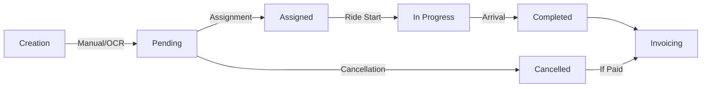

<h1 style='text-align: center'>AMT Horizon</h1>
<h2 style='text-align: center'>ANNEX: Glossary</h2>

<h3 style='text-align: center'>DOCUMENT VERSION 1.0</h3>
<h3 style='text-align: center'>28/01/2026</h3>

---

<h3>Author</h3>

| Name          | Role                        |
| ------------- | --------------------------- |
| Alexis SANTOS | Program Manager / Tech Lead |

<h3>Revision History</h3>

| Date       | Version | Description of Changes                                                                                 |
| ---------- | :-----: | ------------------------------------------------------------------------------------------------------ |
| 28/01/2026 |   1.0   | Initial version. Aligned with FSD/TSD structure. All terms cross-checked for accuracy and consistency. |

---

<details>
<summary>Table of Contents</summary>

- [I. Users \& Roles](#i-users--roles)
- [II. Ride Management](#ii-ride-management)
- [III. Billing \& Payments](#iii-billing--payments)
- [IV. Notifications \& Communication](#iv-notifications--communication)
- [V. Admin Tools](#v-admin-tools)
- [VI. Security \& Compliance](#vi-security--compliance)
- [VII. External Integrations](#vii-external-integrations)
- [Annexes](#annexes)
  - [1. Acronyms \& Abbreviations](#1-acronyms--abbreviations)
  - [2. Thematic Index](#2-thematic-index)
  - [3. Technical Lexicon (for Developers)](#3-technical-lexicon-for-developers)
- [How to Use This Glossary?](#how-to-use-this-glossary)
</details>

---

# I. Users & Roles
**Objective**: Clarify user types, permissions, and responsibilities.

| Term                   | Definition                                                                  | Usage Context                                                         | Example/Visualization                                                             | Related Terms                        | ⚠️ Attention                                                           |
| ---------------------- | --------------------------------------------------------------------------- | --------------------------------------------------------------------- | --------------------------------------------------------------------------------- | ------------------------------------ | --------------------------------------------------------------------- |
| **Admin**              | User with full access to ride, driver, customer, and billing management.    | Manages dashboards, assignments, reports, and system settings.        | *Example*: Marc (55, Business Manager) can view all rides and generate invoices.  | Invoices, Admin Dashboard, Reports   | Cannot be deactivated without another active admin.                   |
| **Driver**             | User who accepts and completes rides.                                       | Receives ride suggestions, manages availability, and tracks earnings. | *Visual*:  (car + star for rating). | Availability, Rating, Suggested Ride | Must validate account with documents (license, vehicle registration). |
| **Customer**           | User who books rides.                                                       | Can book, track rides in real-time, and rate drivers.                 | *Example*: Jean-Michel (62) books a ride to the airport.                          | Booking, GPS Tracking, Rating        | Corporate customers can book for multiple people (e.g., Claire, 41).  |
| **Corporate Customer** | Customer representing a company, able to book rides for multiple employees. | Manages group rides, consolidated invoices, and driver contacts.      | *Use Case*: Booking 5 rides for a team via the Excel-like interface.              | Grouped Invoice, Project, Production | Exceptional discounts require justification.                          |
| **Availability**       | Status indicating whether a driver is ready to accept rides.                | Drivers toggle availability in their dashboard.                       | *Interface*: "Available/Unavailable" button in the driver app.                    | Suggested Ride, Assignment Algorithm | Drivers only receive suggestions when marked as "available".          |

---
**🔹 Further Reading**:
- *Workflow*: [Driver Account Validation Process](#driver-account-validation-process)
- *Personas*: See [III. Personas in FSD](#iii-personas) for concrete examples.

---

# II. Ride Management
**Objective**: Explain the ride lifecycle from creation to invoicing.

| Term               | Definition                                                                                      | Usage Context                                                                     | Example/Visualization                                                                                                                                                                    | Related Terms                     | ⚠️ Attention                                                  |
| ------------------ | ----------------------------------------------------------------------------------------------- | --------------------------------------------------------------------------------- | ---------------------------------------------------------------------------------------------------------------------------------------------------------------------------------------- | --------------------------------- | ------------------------------------------------------------ |
| **Ride**           | Trip from point A to B with a driver and one or more customers.                                 | Created manually, imported via OCR, or suggested by the algorithm.                | *Diagram*: `pending → assigned → completed/cancelled`                                                                                                                                    | Booking, OCR, Status              | Cancellations <2h before departure require a reason.         |
| **Ride Status**    | Current state of a ride (`pending`, `assigned`, `completed`, `cancelled`).                      | Determines possible actions (e.g., `pending` rides can be cancelled or assigned). | **Actions by Status**:<br><li>`pending` → Cancel, assign driver</li><li>`assigned` → Track in real-time, complete</li><li>`completed` → Invoice, rate</li><li>`cancelled` → Archive</li> |                                   |                                                              |
| **Booking**        | Customer action to request a ride.                                                              | Can be done via app, phone (classic customers), or grouped (corporate).           | *Interface*: Form with departure/destination/time fields + price estimate.                                                                                                               | Price, Options, Customer          | Price is locked at booking (no surprises).                   |
| **Suggested Ride** | Ride proposed to a driver based on location and availability.                                   | Drivers see a list of suggested rides and can accept or request assignment.       | *Algorithm*: Prioritizes nearby (5 km) and high-rated drivers.                                                                                                                           | Availability, Rating, Geolocation | Max 5 simultaneous assignment requests per driver.           |
| **Assignment**     | Process of allocating a ride to a driver.                                                       | Can be automatic (algorithm) or manual (admin).                                   | *Example*: Algorithm assigns Djamel (39) to a VIP ride due to his 4.8/5 rating.                                                                                                          | Assignment Algorithm, Driver      | Manual assignment overrides automatic suggestions.           |
| **Options**        | Additional services (VIP, baby seat, van, etc.) added to a ride.                                | Each option has a predefined extra price.                                         | *List*:<br><li>VIP (+€10)</li><li>Baby Seat (+€5)</li>                                                                                                                                   |                                   |                                                              |
| **OCR**            | Optical Character Recognition: Text extraction from photos (tickets, invoices) to create rides. | Used by admins/drivers to avoid manual entry.                                     | *Example*: Photo of a ticket → automatic extraction of date, time, and price.                                                                                                            | Import, Manual Validation         | If OCR fails (accuracy <90%), manual validation is required. |
| **Geolocation**    | Real-time location tracking of drivers and rides via GPS.                                       | Allows customers to track rides and admins to monitor the fleet.                  | *Map*:  (driver/customer icons).                                                                                                       | GPS Tracking, ETA                 | Location data retained for 6 months (GDPR).                  |
| **ETA**            | Estimated Time of Arrival: Real-time updated arrival time.                                      | Displayed to customers during the ride.                                           | *Interface*: "Your driver arrives in 3 min (ETA 14:35)."                                                                                                                                 | GPS Tracking, Notification        | ETA recalculates every 30 seconds.                           |

---
**🔹 Ride Lifecycle Diagram**:


---
**📌 Note**:
- Rides can be **bulk imported** via Excel (specific format).
- **Recurring rides** (e.g., daily shuttles) can be scheduled via *Shift Planning*.

---

# III. Billing & Payments
**Objective**: Describe the invoicing process, from discounts to reminders.

| Term                     | Definition                                                                           | Usage Context                                                             | Example/Visualization                                                                                                                                                   | Related Terms       | ⚠️ Attention                                        |
| ------------------------ | ------------------------------------------------------------------------------------ | ------------------------------------------------------------------------- | ----------------------------------------------------------------------------------------------------------------------------------------------------------------------- | ------------------- | -------------------------------------------------- |
| **Invoice**              | Official document listing rides and costs, auto-generated.                           | Can be individual (per ride) or grouped (per corporate customer/project). | *Template*:<br><li>**Number**: Unique and sequential (e.g., INV-2026-0042)</li><li>**Subtotal**: Ride prices + options</li><li>**Taxes**: Configurable (VAT/local)</li> |                     |                                                    |
| **Grouped Invoice**      | Consolidated invoice for multiple rides for the same customer (typically corporate). | Simplifies management for companies with many rides.                      | *Example*: Monthly invoice for "Paris Shoot" production (50 rides).                                                                                                     | Project, Production | Partial payments (min 30%) allowed.                |
| **Payment Reminder**     | Automatic notification for unpaid invoices (D+14, D+21, D+30).                       | Sent via email and in-app with a link to the invoice.                     | *Email Example*:<br>Subject: Reminder – Overdue Invoice INV-2026-0042                                                                                                   |                     |                                                    |
| **Exceptional Discount** | Manual discount applied by an admin, requiring justification.                        | Used for loyal customers or errors.                                       | *Interface*: Mandatory "Justification" field + percentage (max 50%).                                                                                                    | Audit Log           | Discounts >20% require senior admin approval.      |
| **Partial Payment**      | Option to pay a portion of the due amount (minimum 30%).                             | Useful for customers with cash flow constraints.                          | *Example*: €50 payment on a €200 invoice → status "Partially Paid."                                                                                                     | Invoice Status      | Remaining balance is due by the original deadline. |
| **Invoice Status**       | State of an invoice (`unpaid`, `paid`, `cancelled`).                                 | Determines whether reminders are sent.                                    | **Actions by Status**:<br><li>`unpaid` → Send automatic reminders</li><li>`paid` → Archive after 6 months</li><li>`cancelled` → No action</li>                          |                     |                                                    |

---
**🔹 Reminder Process**:
1. **D+14**: 1st reminder (email + notification).
2. **D+21**: 2nd reminder (+SMS if preferred by customer).
3. **D+30**: 3rd reminder (final before account suspension).

---

# IV. Notifications & Communication
**Objective**: Centralize communication channels between users.

| Term                         | Definition                                                     | Usage Context                                                       | Example/Visualization                                                                                 | Related Terms          | ⚠️ Attention                                                     |
| ---------------------------- | -------------------------------------------------------------- | ------------------------------------------------------------------- | ----------------------------------------------------------------------------------------------------- | ---------------------- | --------------------------------------------------------------- |
| **Notification**             | Alert sent to users (email, in-app, SMS).                      | Informs about new rides, assignments, payments, or urgent messages. | *Examples*:<br><li>"New suggested ride 2 km away!"</li><li>"Invoice INV-2026-0042 due tomorrow."</li> |                        |                                                                 |
| **Real-Time Chat**           | Instant messaging between drivers and customers during a ride. | Allows discussion of details (e.g., precise pickup location).       | *Interface*: 30-day history, encrypted messages.                                                      | Ride, Driver, Customer | Inappropriate messages can be reported via the "Report" button. |
| **Notification Preferences** | User settings to choose notification channels.                 | Configurable in the user profile.                                   | *Options*:<br><li>[x] Email</li><li>[x] In-app Notification</li><li>[ ] SMS (paid)</li>               |                        |                                                                 |

---
**📌 Note**:
- **Urgent notifications** (e.g., ride cancellation) are sent on all active channels.
- **Read notifications** are archived after 30 days.

---

# V. Admin Tools
**Objective**: Present advanced features for admins.

| Term                 | Definition                                                                          | Usage Context                                                        | Example/Visualization                                                                        | Related Terms       | ⚠️ Attention                              |
| -------------------- | ----------------------------------------------------------------------------------- | -------------------------------------------------------------------- | -------------------------------------------------------------------------------------------- | ------------------- | ---------------------------------------- |
| **Excel-like Table** | Interface for bulk management of rides/drivers/customers (filters, sorts, exports). | Used for group assignments or data analysis.                         | *Screenshot*:  (customizable columns). | Export, Reports     | Limited to 10,000 rows per export.       |
| **Reports**          | Auto-generated statistics and analyses (rides, revenue, ratings).                   | Helps identify trends (e.g., top-rated drivers, peak hours).         | *Example*: Monthly revenue chart by vehicle type.                                            | Statistics, KPI     | Reports can be exported as CSV/PDF.      |
| **Activity Log**     | Journal of user actions (for auditing and GDPR compliance).                         | Records who did what and when (e.g., "Admin X cancelled ride #123"). | *Example*:<br>                                                                               | Timestamp           | User                                     | Action | Resource | <br> | 2026-01-28T14:30 | admin@amt.fr | Cancellation | Ride #123 |  |  |  |
| **Shift Planning**   | Scheduling of driver time slots, linked to projects/productions.                    | Helps anticipate driver needs for specific events.                   | *Interface*: Calendar with color-coded slots (green = available, red = busy).                | Project, Production | Shifts must be confirmed 48h in advance. |

---
**🔹 Sample Report**:
```plaintext
Monthly Report – January 2026
=============================
- Completed Rides: 1,245 (+12% vs December)
- Total Revenue: €48,760
- Avg Driver Rating: 4.7/5
- Top 3 Drivers: Djamel (4.9), Sophie (4.8), Karim (4.8)
- Cancellation Rate: 2.3% (target <5%)
```

---

# VI. Security & Compliance
**Objective**: Summarize security measures and legal obligations.

| Term           | Definition                                                    | Usage Context                                                | Example/Visualization                                                                                            | Related Terms | ⚠️ Attention |
| -------------- | ------------------------------------------------------------- | ------------------------------------------------------------ | ---------------------------------------------------------------------------------------------------------------- | ------------- | ----------- |
| **2FA**        | Two-Factor Authentication: Mandatory for admins.              | Enhances account security (SMS code or authenticator app).   | *Workflow*:<br>1. Enter email/password<br>2. Enter 6-digit code (valid 30 sec)                                   |               |             |
| **GDPR**       | General Data Protection Regulation (EU 2016/679).             | Governs personal data collection and storage.                | *Measures*:<br><li>Data retained max 6 months (unless legal obligation)</li><li>Right to erasure on request</li> |               |             |
| **Encryption** | Protection of sensitive data (passwords, payments, messages). | All data encrypted in transit (HTTPS) and at rest (AES-256). | *Certificate*: Let’s Encrypt for the site, database encryption.                                                  |               |             |
| **Backup**     | Automatic data backup (database, files).                      | Enables service restoration in case of failure.              | *Strategy*: Daily backups + monthly restoration test.                                                            |               |             |

---
**📌 GDPR Checklist**:
- [x] Explicit consent for geolocation.
- [x] Data deleted after 6 months (except invoices: 10 years).
- [x] DPO (Data Protection Officer) appointed.

---

# VII. External Integrations
**Objective**: List third-party services and their use.

| Term                   | Definition                                               | Usage Context                                       | Example/Visualization                                                                       | Related Terms          | ⚠️ Attention                                |
| ---------------------- | -------------------------------------------------------- | --------------------------------------------------- | ------------------------------------------------------------------------------------------- | ---------------------- | ------------------------------------------ |
| **Mapbox/Google Maps** | Mapping service for geolocation and route calculation.   | Displays rides in real-time and estimates ETAs.     | *Map*: Route in progress (blue line) and driver location (car icon).                        | Geolocation, ETA       | Requires API key (cost based on requests). |
| **Stripe/PayPal**      | Secure online payment solutions.                         | Handles card payments, refunds, and webhooks.       | *Workflow*:<br>1. Customer pays via Stripe<br>2. Webhook confirms payment → invoice update. |                        |                                            |
| **Tesseract.js**       | Open-source OCR library for text extraction from images. | Used to extract data from scanned tickets/invoices. | *Example*: Blurry photo → extracted text with confidence score (e.g., 92%).                 | OCR, Manual Validation | If score <90%, manual validation required. |

---

# Annexes

## 1. Acronyms & Abbreviations
| Acronym | Meaning                            | Context                      |
| ------- | ---------------------------------- | ---------------------------- |
| OCR     | Optical Character Recognition      | Ride import via photos.      |
| ETA     | Estimated Time of Arrival          | Real-time ride tracking.     |
| GDPR    | General Data Protection Regulation | Legal compliance.            |
| 2FA     | Two-Factor Authentication          | Account security.            |
| FSD     | Functional Specification Document  | This document.               |
| TSD     | Technical Specification Document   | Technical complement to FSD. |

---
## 2. Thematic Index
| Theme         | Page |
| ------------- | ---- |
| Users         | 1    |
| Rides         | 2    |
| Billing       | 3    |
| Notifications | 4    |
| Admin Tools   | 5    |
| Security      | 6    |
| Integrations  | 7    |

---
## 3. Technical Lexicon (for Developers)
| Term            | Definition                                              | Usage Example                                                   |
| --------------- | ------------------------------------------------------- | --------------------------------------------------------------- |
| **Drizzle ORM** | TypeScript tool for PostgreSQL interactions.            | `const rides = await db.query.rides.findMany();`                |
| **Zod**         | Schema validation library for TypeScript.               | `const CreateRideSchema = z.object({ departure: z.string() });` |
| **Neon**        | Serverless PostgreSQL database used by AMT Horizon.     | Configuration in `drizzle.config.ts`.                           |
| **Vercel Cron** | Scheduled tasks for invoice reminders and log cleanups. | `0 9 * * *` (daily at 9 AM).                                    |

---

# How to Use This Glossary?
1. **New Users**: Start with *Users & Roles* to understand roles.
2. **Admins**: Focus on *Admin Tools* and *Security*.
3. **Drivers/Customers**: Prioritize *Ride Management* and *Notifications*.
4. **Need Help?**: **Bold** terms are defined in the glossary. Links ➡️ point to related sections.
