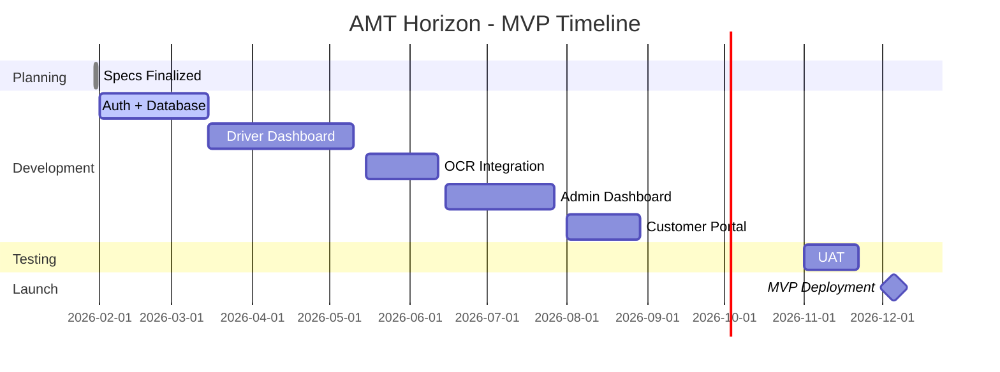

<h1 style='text-align: center'>AMT Horizon</h1>
<h2 style='text-align: center'>Project Brief</h2>
<h3 style='text-align: center'>DOCUMENT VERSION 2.0</h3>
<h3 style='text-align: center'>30/01/2026</h3>

---

<h3>Author</h3>

| Name          | Role                        |
| ------------- | --------------------------- |
| Alexis SANTOS | Tech Lead / Project Manager |

<h3>Revision History</h3>

| Date       | Version | Description of Changes                                                                                                      |
| ---------- | :-----: | --------------------------------------------------------------------------------------------------------------------------- |
| 30/01/2026 |   1.0   | Initial draft with comprehensive sections.                                                                                  |
| 30/01/2026 |   2.0   | Merged and optimized content; removed academic references; added contingency plans, risk mitigation, and technical details. |

---

<strong>Table of Contents</strong>

- [I. Executive Summary](#i-executive-summary)
- [II. Project Overview](#ii-project-overview)
  - [A. Business Context](#a-business-context)
  - [B. Problem Statement](#b-problem-statement)
  - [C. Proposed Solution](#c-proposed-solution)
- [III. Project Objectives](#iii-project-objectives)
  - [A. Business Goals](#a-business-goals)
  - [B. User Goals](#b-user-goals)
  - [C. Success Criteria (MVP)](#c-success-criteria-mvp)
- [IV. Project Scope](#iv-project-scope)
  - [A. In Scope (MVP - December 2025)](#a-in-scope-mvp---december-2025)
  - [B. Out of Scope](#b-out-of-scope)
- [V. Stakeholders](#v-stakeholders)
  - [A. Core Team](#a-core-team)
  - [B. End Users](#b-end-users)
  - [C. Key Contacts](#c-key-contacts)
- [VI. Key Features and Requirements](#vi-key-features-and-requirements)
  - [A. Driver Interface](#a-driver-interface)
  - [B. Customer Interface](#b-customer-interface)
  - [C. Admin Interface](#c-admin-interface)
- [VII. Constraints](#vii-constraints)
  - [A. Technical Constraints](#a-technical-constraints)
  - [B. Regulatory and Compliance](#b-regulatory-and-compliance)
  - [C. Timeline and Resources](#c-timeline-and-resources)
- [VIII. Technical Stack](#viii-technical-stack)
  - [A. Development Technologies](#a-development-technologies)
  - [B. Tools and Infrastructure](#b-tools-and-infrastructure)
- [IX. Project Timeline](#ix-project-timeline)
  - [A. Milestones](#a-milestones)
  - [B. Contingency Plan](#b-contingency-plan)
- [X. Risks and Mitigation](#x-risks-and-mitigation)
- [XI. Budget and Resources](#xi-budget-and-resources)
- [XII. Communication Plan](#xii-communication-plan)
- [XIII. Approval and Sign-off](#xiii-approval-and-sign-off)

---

# I. Executive Summary

**AMT Horizon** is a **web-based fleet management platform** designed to **automate ride assignments, billing, and real-time tracking** for AMT CGS GROUPE's taxi operations. The platform replaces manual, error-prone processes with a **scalable, cost-efficient digital solution**, reducing operational overhead while improving driver utilization and customer satisfaction.

**Key Innovations:**
- **OCR-Powered Ticket Import:** Drivers upload photos of tickets; the system automatically extracts ride details.
- **Smart Ride Suggestions:** AI-driven assignments based on driver location and availability.
- **Automated Billing:** One-click invoice generation with payment reminders.
- **Real-Time Communication:** In-app chat between drivers and customers.

**Project Snapshot:**
| Item                | Detail                                                                    |
| ------------------- | ------------------------------------------------------------------------- |
| **Target Launch**   | December 2025 (MVP)                                                       |
| **Development**     | Part-time (Fridays only)                                                  |
| **Budget**          | $0 (leveraging free-tier cloud services)                                  |
| **Users**           | 5 admins, 200+ drivers, 100+ customers (scalable to 500+)                 |
| **Tech Stack**      | NextJS, TypeScript, Neon (PostgreSQL), Tesseract.js (OCR)                 |
| **Hosting**         | Vercel (frontend), Neon (database)                                        |
| **Expected Impact** | 70% reduction in manual data entry, 40% improvement in driver utilization |

---

# II. Project Overview

## A. Business Context
AMT CGS GROUPE manages a fleet of 200+ taxis, currently relying on **manual processes** for ride assignments, ticket entry, and billing. This leads to inefficiencies, lost revenue, and poor customer experience.

**Opportunity:** A **digital platform** to streamline operations, reduce costs, and enhance service quality.

## B. Problem Statement
| Pain Point              | Current Process                          | Impact                          |
| ----------------------- | ---------------------------------------- | ------------------------------- |
| Manual ticket entry     | Admins transcribe paper tickets          | Errors, delays, 10h/week lost   |
| Inefficient assignments | Dispatchers assign rides via phone/radio | 20% idle time for drivers       |
| No real-time tracking   | Customers call for ETAs                  | Low satisfaction, lost bookings |
| Manual billing          | Invoices created in Excel                | Payment delays, errors          |

## C. Proposed Solution
A **three-sided platform** (Admin/Driver/Customer) with:
1. **OCR Import:** Drivers upload ticket photos; the system extracts data (date, fare, route).
2. **Smart Assignments:** Algorithm suggests rides based on driver location and history.
3. **Automated Billing:** Invoices generated from ride data; payment tracking.
4. **Real-Time Chat:** Drivers and customers communicate via in-app messages.

**Differentiators:**
- **No monthly fees** (unlike Uber/Didi).
- **Local focus** (optimized for AMT CGS GROUPE’s operations).
- **OCR + AI** (reduces manual work by 70%).

---

# III. Project Objectives

## A. Business Goals
| Goal                        | Metric                      | Target     |
| --------------------------- | --------------------------- | ---------- |
| Reduce admin workload       | Hours spent on data entry   | -70%       |
| Increase driver utilization | % of available driving time | +40%       |
| Improve billing accuracy    | % of error-free invoices    | 99%        |
| Boost customer satisfaction | Net Promoter Score (NPS)    | +30 points |

## B. User Goals
| User Type     | Key Needs                                 | Solution in AMT Horizon              |
| ------------- | ----------------------------------------- | ------------------------------------ |
| **Admins**    | Fast ride assignments, error-free billing | Dashboard + automated invoicing      |
| **Drivers**   | More rides, transparent earnings          | Smart suggestions + earnings tracker |
| **Customers** | Easy booking, real-time updates           | Web app + chat/notifications         |

## C. Success Criteria (MVP)
| Criteria             | Target                       |
| -------------------- | ---------------------------- |
| OCR accuracy         | ≥85% on printed tickets      |
| Driver adoption rate | 80% within 30 days of launch |
| Admin time savings   | ≥10h/week                    |
| System uptime        | 99% during business hours    |

---

# IV. Project Scope

## A. In Scope (MVP - December 2025)
| Feature             | Priority | Description                               |
| ------------------- | -------- | ----------------------------------------- |
| User authentication | 5        | Role-based access (Admin/Driver/Customer) |
| OCR ticket import   | 5        | Photo upload → data extraction            |
| Ride assignments    | 5        | Manual + AI suggestions                   |
| Invoicing           | 4        | PDF generation + payment tracking         |
| In-app chat         | 3        | Drivers ↔ Customers                       |
| Basic analytics     | 3        | Rides completed, earnings, response times |

## B. Out of Scope
| Feature                  | Reason                                  |
| ------------------------ | --------------------------------------- |
| Native mobile apps       | Web-responsive suffices for MVP         |
| Real-time GPS tracking   | Post-MVP (requires additional dev time) |
| Third-party integrations | Focus on core workflow first            |

---

# V. Stakeholders

## A. Core Team
| Name          | Role          | Responsibilities               |
| ------------- | ------------- | ------------------------------ |
| Alexis SANTOS | Tech Lead     | Architecture, backend, dev ops |
| [AMT Contact] | Product Owner | Requirements, user testing     |

## B. End Users
| User Type | Count (Est.) | Key Needs                               |
| --------- | ------------ | --------------------------------------- |
| Admins    | 5            | Operational control, reporting          |
| Drivers   | 200+         | Ride assignments, earnings transparency |
| Customers | 100+         | Easy booking, reliable service          |

## C. Key Contacts
| Name          | Role              | Contact                  |
| ------------- | ----------------- | ------------------------ |
| [AMT Manager] | Executive Sponsor | amtcgsgroupe@gmail.com   |
| Alexis SANTOS | Technical Lead    | alexisamsantos@gmail.com |

---

# VI. Key Features and Requirements

## A. Driver Interface
**MVP:**
- Upload ticket photos (OCR processing).
- View/accept suggested rides.
- Earnings dashboard (daily/weekly).
- Chat with customers.

**Post-MVP:**
- Real-time GPS navigation.
- Performance analytics.

## B. Customer Interface
**MVP:**
- Book rides (fare estimate).
- Driver ETA + contact info.
- Payment confirmation.

**Post-MVP:**
- Ride history + loyalty rewards.

## C. Admin Interface
**MVP:**
- Manage drivers/customers.
- Assign rides manually.
- Generate invoices.
- View basic analytics.

---

# VII. Constraints

## A. Technical Constraints
| Constraint         | Solution                                      |
| ------------------ | --------------------------------------------- |
| Part-time dev      | Agile sprints (Fridays only)                  |
| Free-tier services | Optimize queries, monitor usage               |
| OCR limitations    | Manual correction UI for low-confidence reads |

## B. Regulatory and Compliance
- **GDPR:** Data encryption, user consent, 6-month retention.
- **Accessibility:** WCAG 2.1 AA (partial for MVP).
- **Security:** 2FA for admins, RBAC, input validation.

## C. Timeline and Resources
- **Development:** 40 Fridays (Feb–Dec 2025).
- **Hosting:** Vercel (frontend), Neon (database).
- **Budget:** $0 (free tiers); scalable to $50/month.

---

# VIII. Technical Stack

## A. Development Technologies
**Frontend:**
- Framework: NextJS 14+ (React-based)
- Language: TypeScript
- Styling: Tailwind CSS, PostCSS
- State Management: Zustand

**Backend:**
- Runtime: Node.js (via NextJS API routes)
- Database: Neon (Serverless PostgreSQL)
- ORM: Drizzle ORM
- Authentication: better-auth

**Real-Time Features:**
- WebSockets for chat (Socket.io with NextJS)

**OCR Processing:**
- OCR Engine: Tesseract.js (client-side processing)
- Alternative: Google Cloud Vision API (free tier)

## B. Tools and Infrastructure
**Development Tools:**
- IDE: Visual Studio Code
- Version Control: GitHub
- Project Management: GitHub Projects
- Package Manager: pnpm

**Deployment & Infrastructure (Free Tier):**
- Hosting: Vercel (free tier)
- Database: Neon (free tier - 0.5GB storage)
- CI/CD: GitHub Actions

---

# IX. Project Timeline

## A. Milestones

## B. Contingency Plan
| Risk                     | Mitigation                            |
| ------------------------ | ------------------------------------- |
| OCR accuracy <85%        | Manual correction workflow            |
| Free-tier limits reached | Archive old data, upgrade if approved |
| Delays in development    | Reduce scope (e.g., defer analytics)  |

---

# X. Risks and Mitigation
| Risk                             | Probability | Impact | Mitigation                      |
| -------------------------------- | ----------- | ------ | ------------------------------- |
| OCR fails on handwritten tickets | High        | Medium | Manual entry fallback           |
| Driver adoption <80%             | Medium      | High   | Incentives (e.g., bonus rides)  |
| Vercel/Neon downtime             | Low         | High   | Monitor status pages, backup DB |

---

# XI. Budget and Resources
**Total MVP Budget:** $0/month (utilizing free-tier services)
**Production Scale Budget:** $25-50/month (estimated for 1,000+ active users)

| Service         | Free Tier Limits                 | Cost | Notes                          |
| --------------- | -------------------------------- | ---- | ------------------------------ |
| Vercel Hosting  | 100GB bandwidth/month            | €0   | Perfect for MVP deployment     |
| Neon Database   | 0.5GB storage, 512MB RAM         | €0   | Sufficient for testing/demo    |
| Tesseract.js    | Unlimited (client-side)          | €0   | OCR processing                 |
| Google Maps API | $200 credit/month (28,000 loads) | €0   | Geolocation & maps (free tier) |

---

# XII. Communication Plan
- **Weekly Updates:** Email to stakeholders (progress, blockers).
- **Sprint Demos:** weekly (recorded for async review).
- **Tools:** GitHub (issues).

---

# XIII. Approval and Sign-off

| Name          | Role              | Signature | Date       |
| ------------- | ----------------- | --------- | ---------- |
| Alexis SANTOS | Tech Lead         |           | 2026-01-30 |
| [AMT Manager] | Executive Sponsor |           |            |
