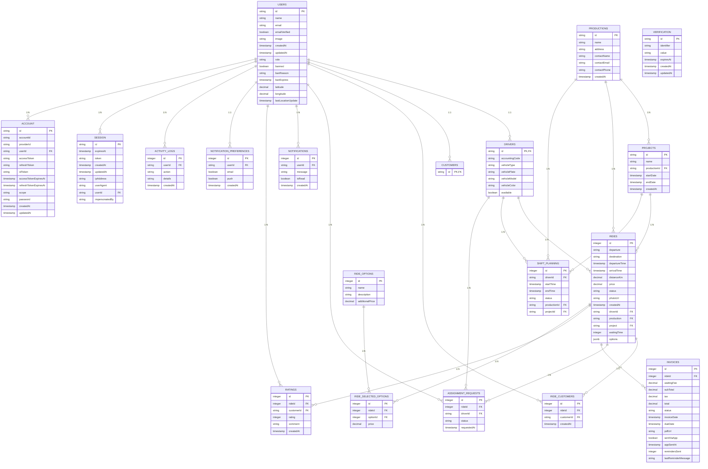

```mermaid
erDiagram
    %% ========== ENTITÉS PRINCIPALES ==========
    USERS ||--o{ DRIVERS : "1:1"
    USERS ||--o{ CUSTOMERS : "1:1"
    USERS ||--o{ RIDE_CUSTOMERS : "1:N"
    USERS ||--o{ ASSIGNMENT_REQUESTS : "1:N"
    USERS ||--o{ NOTIFICATIONS : "1:N"
    USERS ||--o{ RATINGS : "1:N"
    USERS ||--o{ NOTIFICATION_PREFERENCES : "1:1"
    USERS ||--o{ ACTIVITY_LOGS : "1:N"

    PRODUCTIONS ||--o{ PROJECTS : "1:N"
    PRODUCTIONS ||--o{ RIDES : "1:N"
    PRODUCTIONS ||--o{ SHIFT_PLANNING : "1:N"

    PROJECTS ||--o{ RIDES : "1:N"
    PROJECTS ||--o{ SHIFT_PLANNING : "1:N"

    RIDES ||--o{ RIDE_CUSTOMERS : "1:N"
    RIDES ||--o{ ASSIGNMENT_REQUESTS : "1:N"
    RIDES ||--o{ INVOICES : "1:1"
    RIDES ||--o{ RATINGS : "1:N"
    RIDES ||--o{ RIDE_SELECTED_OPTIONS : "1:N"

    RIDE_OPTIONS ||--o{ RIDE_SELECTED_OPTIONS : "1:N"

    DRIVERS ||--o{ RIDES : "1:N"
    DRIVERS ||--o{ SHIFT_PLANNING : "1:N"
    DRIVERS ||--o{ ASSIGNMENT_REQUESTS : "1:N"

    %% ========== DÉFINITION DES ENTITÉS ==========
    USERS {
        string id PK
        string name
        string email
        boolean emailVerified
        string image
        timestamp createdAt
        timestamp updatedAt
        string role
        boolean banned
        string banReason
        timestamp banExpires
        decimal latitude
        decimal longitude
        timestamp lastLocationUpdate
    }

    DRIVERS {
        string id PK, FK
        string accountingCode
        string vehicleType
        string vehiclePlate
        string vehicleModel
        string vehicleColor
        boolean available
    }

    CUSTOMERS {
        string id PK, FK
    }

    PRODUCTIONS {
        string id PK
        string name
        string address
        string contactName
        string contactEmail
        string contactPhone
        timestamp createdAt
    }

    PROJECTS {
        string id PK
        string name
        string productionId FK
        timestamp startDate
        timestamp endDate
        timestamp createdAt
    }

    RIDES {
        integer id PK
        string departure
        string destination
        timestamp departureTime
        timestamp arrivalTime
        decimal distanceKm
        decimal price
        string status
        string photoUrl
        timestamp createdAt
        string driverId FK
        string production FK
        string project FK
        integer waitingTime
        jsonb options
    }

    SHIFT_PLANNING {
        integer id PK
        string driverId FK
        timestamp startTime
        timestamp endTime
        string status
        string productionId FK
        string projectId FK
    }

    RIDE_OPTIONS {
        integer id PK
        string name
        string description
        decimal additionalPrice
    }

    RIDE_SELECTED_OPTIONS {
        integer id PK
        integer rideId FK
        integer optionId FK
        decimal price
    }

    RIDE_CUSTOMERS {
        integer id PK
        integer rideId FK
        string customerId FK
        timestamp createdAt
    }

    ASSIGNMENT_REQUESTS {
        integer id PK
        integer rideId FK
        string driverId FK
        string status
        timestamp requestedAt
    }

    INVOICES {
        integer id PK
        integer rideId FK
        decimal waitingFee
        decimal subTotal
        decimal tax
        decimal total
        string status
        timestamp invoiceDate
        timestamp dueDate
        string pdfUrl
        boolean sentViaApp
        timestamp appSentAt
        integer remindersSent
        string lastReminderMessage
    }

    NOTIFICATIONS {
        integer id PK
        string userId FK
        string message
        boolean isRead
        timestamp createdAt
    }

    RATINGS {
        integer id PK
        integer rideId FK
        string customerId FK
        integer rating
        string comment
        timestamp createdAt
    }

    NOTIFICATION_PREFERENCES {
        integer id PK
        string userId FK
        boolean email
        boolean push
        timestamp createdAt
    }

    ACTIVITY_LOGS {
        integer id PK
        string userId FK
        string action
        string details
        timestamp createdAt
    }

    %% ========== TABLES D'AUTHENTIFICATION (À PART) ==========
    USERS ||--o{ SESSION : "1:N"
    USERS ||--o{ ACCOUNT : "1:N"

    SESSION {
        string id PK
        timestamp expiresAt
        string token
        timestamp createdAt
        timestamp updatedAt
        string ipAddress
        string userAgent
        string userId FK
        string impersonatedBy
    }

    ACCOUNT {
        string id PK
        string accountId
        string providerId
        string userId FK
        string accessToken
        string refreshToken
        string idToken
        timestamp accessTokenExpiresAt
        timestamp refreshTokenExpiresAt
        string scope
        string password
        timestamp createdAt
        timestamp updatedAt
    }

    VERIFICATION {
        string id PK
        string identifier
        string value
        timestamp expiresAt
        timestamp createdAt
        timestamp updatedAt
    }
```